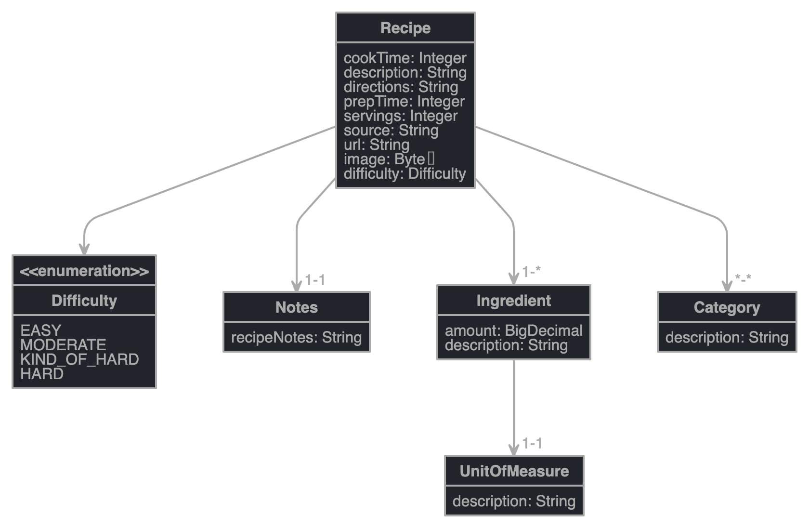

[](https://circleci.com/gh/hwisunbae/spring-recipe-app)

# Recipe Application
The purpose of this repo is to have a great start of building an application upon Spring Framework.  

# Data Model

*Created by jdl-studio*
```aidl
entity Recipe {
	cookTime Integer,
	description String,
    directions String,
    prepTime Integer,
    servings Integer,
    source String,
    url String,
    image Byte,
    difficulty Difficulty
}

entity Category {
	description String
}

entity Ingredient {
	amount BigDecimal,
    description String
}

entity UnitOfMeasure {
	description String
}

entity Notes {
	recipeNotes String
}
enum Difficulty {
    EASY, MODERATE, KIND_OF_HARD, HARD
}

relationship OneToOne {
	Recipe{recipe} to Notes
}

relationship OneToMany {
	Recipe{recipe} to Ingredient
}

relationship OneToOne {
	Ingredient{ingredient} to UnitOfMeasure
}

relationship ManyToMany {
	Recipe{recipe} to Category
}

```

# License
Copyright by Hwisun Bae, 2020